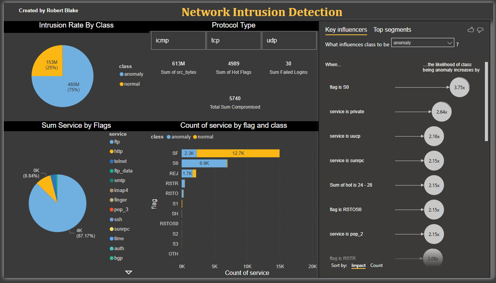

# Network Intrusion Report in Power BI

An interactive Power BI report analyzing network intrusions using the [Kaggle Network Intrusion Detection dataset](https://www.kaggle.com/datasets/sampadab17/network-intrusion-detection).

## Overview
This report visualizes intrusion rates by protocol (e.g., TCP at ~80% anomaly) and flag (e.g., SO at 100%), with interactive slicers for `protocol_type`, `flag`, and `service`, key metrics like `Sum of Hot Flags` (4989) with tooltips, and a clean, user-friendly design. It helps identify potential security threats by highlighting high-risk patterns in network traffic.

## Features
- Visualizations: Intrusion rate by class, protocol, and flag.
- Interactive slicers for filtering by `protocol_type`, `flag`, and `service`.
- Key metrics with tooltips for context (e.g., "Hot Flags indicate attempts to access sensitive files").
- Clean design with sorted charts, aligned cards, and simplified visuals.

## Skills Demonstrated
- **DAX**: Created measures like `Intrusion Rate` to calculate anomaly proportions.
- **Power Query**: Transformed data by grouping `service` categories.
- **Data Visualization**: Designed intuitive visuals for cybersecurity analysis.
- **Dashboard Design**: Built a user-friendly, interactive dashboard.

## Files
- [Network_Intrusion_Report_20250606.pbix](Network_Intrusion_Report_20250606.pbix): The Power BI file for the dashboard.
-  [Network_Intrusion_Report_Screenshot.png](Network_Intrusion_Report_Screenshot.PNG)

: A screenshot of the Report.

## How to Use
1. Download the `.pbix` file.
2. Open it in Power BI Desktop to explore the interactive Report.
3. Use the slicers to filter by protocol, flag, or service, and hover over cards to see tooltips.

## Credits
- Dataset: Kaggle Network Intrusion Detection dataset by Sampada Bhattacharya.
- Power BI Report Created by Robert Blake.

## Contact
I’m seeking opportunities as a Power BI Data Analyst. Feel free to connect with me [Robert Blake] on [LinkedIn]([https://www.linkedin.com/in/robert-blake-0aa20936a] or email me at it643c@gmail.com for feedback or job opportunities!
